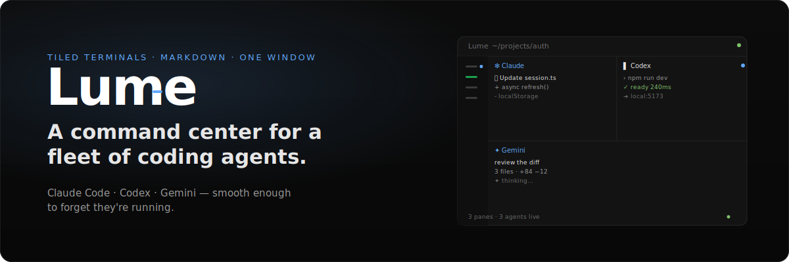
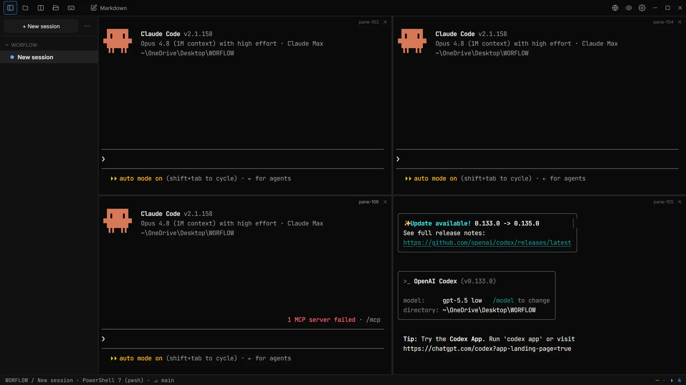
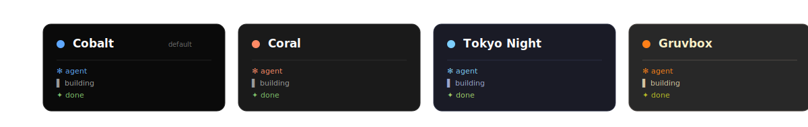

<p align="center">
  
</p>

<p align="center">
  <strong>Tiled terminals · markdown · one window.</strong><br/>
  Claude Code, Codex, Gemini — smooth enough to forget they're running.
</p>

<p align="center">
  <a href="https://github.com/rithwik1510/Lume/releases"></a>
  <a href="https://github.com/rithwik1510/Lume/releases/tag/v0.1.0-beta.7"></a>
  <a href="https://github.com/rithwik1510/Lume/blob/main/LICENSE"></a>
  
  
  <a href="https://github.com/rithwik1510/Lume/actions/workflows/ci.yml"></a>
</p>

<p align="center">
  <a href="https://lume-gold-pi.vercel.app/download"><strong>⬇ Download for Windows</strong></a> ·
  <a href="https://lume-gold-pi.vercel.app/">Website</a> ·
  <a href="https://github.com/rithwik1510/Lume/releases">Releases</a> ·
  <a href="https://github.com/rithwik1510/Lume/issues">Issues</a>
</p>

---

<p align="center">
  
</p>

<p align="center"><sub>The real app, untouched — four agents live at once, <em>auto mode on</em>, not a dropped frame.</sub></p>

<br/>

## It doesn't tear under load.

Bytes stream **Rust → renderer**, never through the UI state. Flood every pane — typing still lands first. Lume is built to pass the **2am test**: three agents streaming, a release build, you typing through all of it — at once. No tearing.

<table align="center">
  <tr>
    <td align="center"><strong>&lt;30ms</strong><br/><sub>typing latency</sub></td>
    <td align="center"><strong>32ms</strong><br/><sub>ipc batch window</sub></td>
    <td align="center"><strong>&lt;500MB</strong><br/><sub>memory, 4 panes</sub></td>
    <td align="center"><strong>&lt;2s</strong><br/><sub>cold start</sub></td>
  </tr>
</table>

The renderer is **WebGL** (xterm.js), fed by real PTYs (`portable-pty`) with an 8 MB ring buffer per pane. Only on-screen sessions render live and hold WebGL contexts; background agents keep running but their output is buffered and replayed instantly when you return. WebGL contexts are pooled (LRU, cap 8) and reclaimed under pressure — so the fleet never stalls, even past WebView2's context ceiling.

---

## Why

You run more than one coding agent now. Claude Code in one window, Codex in another, Gemini in a third — and a markdown plan open somewhere to track them all. Your OS window manager wasn't built for this. Lume was.

One window. Tiled terminals that don't tear when every pane streams at once. A markdown editor beside them so you can watch a plan take shape as an agent writes it. Keyboard-first, because your hands were already on the keys.

> The full design rationale lives in [`DESIGN.md`](./DESIGN.md). The domain glossary is [`CONTEXT.md`](./CONTEXT.md). Architecture decisions are under [`docs/adr/`](./docs/adr/).

---

## Features

### 01 · Smoothness
**It doesn't tear under load.** Output streams straight to the renderer — the UI state never sees it. Typing always lands first, even with every pane flooding.

### 02 · Tiling
**Split without the seams.** One pane becomes many. Every pane keeps streaming; nothing reflows with a jolt. Split right, split down, move focus — all from the keyboard.

### 03 · Markdown
**Read what they write.** Agents think in markdown. Lume renders it beside your panes — watch a plan take shape as it's written, then watch it get done. `Ctrl+Click` any file path to open it, `Ctrl+E` to edit, `Ctrl+Shift+M` for the Quick Viewer.

### 04 · Keyboard-first
**Your hands never leave home row.** Every action has a key. Rebind any of them in `config.toml`.

### 05 · Themes
**Four palettes. One aesthetic.** Dark, always. Same geometry and motion — only the colour shifts. They all ship in the app.

### 06 · Agent awareness
**Know exactly what each agent is doing — without guessing.** Turn on **Precise Claude Code signals** (Settings → Agents) and Lume installs Claude Code hooks so every session announces its own state. A background pane's dot then means something exact: a hollow accent ring when the agent is *blocked on a permission prompt*, a steady accent dot when a *turn is complete and it's your move*, the tumbling square while it's *working*. Blocked and your-move counts roll up into the status bar, so nothing needing you is ever hidden. Opt-in, additive, and fully reversible — it merges into `~/.claude/settings.json` and removes itself cleanly.

<p align="center">
  
</p>

---

## Quick start — run your agents in Lume

### 1. Install (Windows)

**One command** (needs Node 18+):

```bash
npx lume-desktop
```

Or grab `Lume_<version>_x64-setup.exe` from the [Releases page](https://github.com/rithwik1510/Lume/releases) and run it.

> ⚠️ The installer is **unsigned during beta**. Windows SmartScreen shows *"Windows protected your PC."* Click **More info → Run anyway**. It installs to your user profile (no admin needed) and auto-updates itself from then on.
>
> Windows 11 ships the WebView2 runtime Lume needs. On older Windows 10, install the [Evergreen WebView2 Runtime](https://developer.microsoft.com/microsoft-edge/webview2/) first.

### 2. Open a project & launch an agent

Lume opens into a single terminal pane. `cd` into your project and start an agent the way you always do:

```bash
cd ~/projects/auth
claude          # or: codex, gemini, aider, cursor-agent …
```

### 3. Split panes — run agents side by side

| Action | Key |
|---|---|
| Split right | `Ctrl+Alt+→` |
| Split down | `Ctrl+Alt+↓` |
| Move focus between panes | `Ctrl+→` |
| Close focused pane | `Ctrl+W` |

Split a second pane, launch Codex. Split a third, launch Gemini. Every pane keeps streaming — nothing tears.

### 4. Watch the plan as it's written

Press `Ctrl+E` to open the markdown editor, or `Ctrl+Shift+M` for the Quick Viewer. Open your `PLAN.md` and watch an agent fill it in, rendered live beside the terminal that's writing it.

### 5. Read the attention signals

Each background session shows one honest signal so you can leave agents running and still know which one needs you:

- **Tumbling square** while a background agent or command is working
- **Solid accent dot** (steady glow) when a turn finishes — your move
- **Hollow accent ring** (glow pulse) when an agent is blocked on a permission prompt
- **Hollow grey dot** when idle

With **Precise Claude Code signals** enabled (Settings → Agents), these come straight from Claude Code's own lifecycle hooks — the exact state, per pane, including the mid-turn *"blocked on permission"* moment no heuristic can see. Without hooks (or for other shells and agents), Lume falls back to **shell-reported command lifecycle** (FinalTerm / OSC 133) and output cadence. Either way, switching or resizing panes won't fake a signal, and the session you're looking at never nags. The full legend is in the `Ctrl+?` shortcuts modal.

### 6. Close and come back

Lume **session-restores** your whole fleet on relaunch — layout, shells, and working folders all return (running processes can't survive a restart, but the structure does).

---

## Keyboard shortcuts

| Action | Default |
|---|---|
| Split right / up / down | `Ctrl` `Alt` `→` / `↑` / `↓` |
| Move focus between panes | `Ctrl` `→` / `←` / `↑` / `↓` |
| Toggle markdown editor | `Ctrl` `E` |
| Toggle Quick Viewer | `Ctrl` `Shift` `M` |
| Toggle sidebar | `Ctrl` `B` |
| Close focused pane | `Ctrl` `W` |
| Copy in a terminal | `Ctrl+Shift+C` (or `Ctrl+C` with a selection — copies, then clears) |
| Paste in a terminal | `Ctrl+Shift+V` |
| Keyboard shortcuts viewer | `Ctrl` `?` |

> **Selection in mouse-reporting TUIs** (Claude Code, Codex, vim): hold **Shift** while dragging to select text — otherwise the TUI eats the mouse events.

Every key is rebindable in `config.toml`.

---

## Stack

| Layer | Choice |
|---|---|
| Desktop shell | Tauri v2 (Rust host + WebView2 on Windows) |
| Front-end | React 18 + Vite + TypeScript |
| State | Zustand + Immer + devtools (slices, atomic selectors) |
| Terminals | xterm.js + `@xterm/addon-webgl` + `@xterm/addon-fit` |
| PTY | `portable-pty` (Rust) with 32 ms batched IPC + 8 MB ring buffer |
| Markdown | CodeMirror 6 (editor) + `markdown-it` + DOMPurify (preview) |
| Persistence | `@tauri-apps/plugin-store` |

See [`docs/adr/0001-frontend-stack.md`](./docs/adr/0001-frontend-stack.md) for the rationale.

## Build & run

Requirements (Windows 11):

- Rust stable (`rustup`)
- Node.js 20+
- Visual Studio Build Tools with the *"Desktop development with C++"* workload
- WebView2 runtime (ships with Windows 11)

```bash
npm install
npm run tauri dev
```

## Test

```bash
npm test               # vitest
npm run typecheck      # tsc --noEmit
cd src-tauri
cargo test --lib       # Rust unit tests
cargo clippy --all-targets -- -D warnings
cargo fmt --all -- --check
```

CI runs the same set on `windows-latest` for every push to `main` (see [`.github/workflows/ci.yml`](./.github/workflows/ci.yml)).

## Project layout

```
src/                  React + Zustand front-end
  components/         TerminalPane and friends
  store/              Zustand slices (layoutStore, ptyStore, throttle)
  terminals/          Module-level Terminal registry + PTY orchestrator
  types/              Shared types (mirror Rust enums)
src-tauri/            Rust host
  src/
    error.rs          AppError thiserror enum (mirrors TS AppError)
    pty.rs            PTY commands, ring buffer, batched IPC
    lib.rs            Tauri Builder entry
  capabilities/       Tauri v2 capability declarations
  tauri.conf.json     App config
docs/adr/             Architecture Decision Records
spike-archive/        Weekend 0 spike source (preserved for reference)
```

---

## Roadmap

- [x] Windows public beta
- [x] Visibility-driven render governor (bound cost to on-screen sessions)
- [x] OSC 133 agent attention system
- [x] Session restore
- [ ] macOS support
- [ ] Linux support
- [ ] Pane-level scrollback search
- [ ] Configurable per-pane shells & profiles

---

## Contributing

Lume is MIT-licensed and built in the open. Bug reports and PRs are welcome on [GitHub](https://github.com/rithwik1510/Lume).

1. Fork & branch from `main`.
2. `npm install && npm run tauri dev` to run.
3. Keep CI green: `npm test`, `npm run typecheck`, `cargo clippy`, `cargo fmt`.
4. Open a PR — describe the *why*, link any relevant `docs/adr/` entry.

## License

MIT — see [`LICENSE`](./LICENSE).

---

<p align="center">
  
</p>
